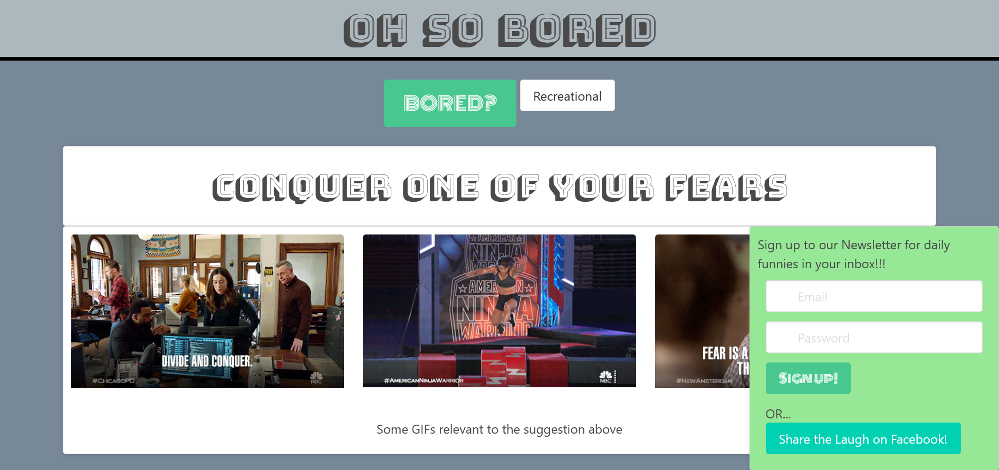

# Oh So Bored

A website intended to help people who are bored to find soemthing to do

## Technologies used

Bored API: https://www.boredapi.com/

GIPHY API: https://developers.giphy.com/

Bulma CSS Framework: https://bulma.io/ 

## Description
Welcome to Oh So Bored, the place to go if you're bored! (elaborate)

It's very simple at first: there will be a large button with a dropdown menu next to it, and a modal in the lower right corner. The dropdown can be used to filter which types of responses Bored API returns. Upon pushing the button, two cards will appear below the button. The top card will have the suggestion of what to do from Bored API. Below that will be three GIFs from giphy all relevant to the suggestion Bored API gave. If the first suggestion isn't to your liking, push the large button again to get a different suggestion. The modal can be used to share a GIF you found funny on FaceBook, and will eventually be used to send newsletters out to those who so desire them.

## What it looks like

## Link to website
https://adamolson11.github.io/OhSo_Bored/

# Presentation outline link
https://docs.google.com/document/d/1aO9TDikizAu3OxARf6QlKS4tt8lbXJeWdu-vXyApP0Q/edit?usp=sharing